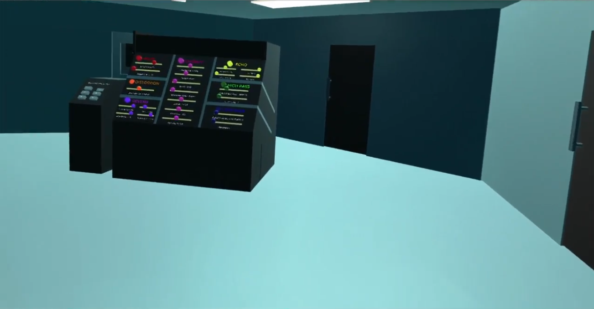

# Sea For Yourself: A Virtual Reality-Based Digital Audio Workstation Prototype
A VR-based installation piece and digital audio workstation called *Sea For Yourself*, originally designed in 2020 for ENSE 479 / CTCH 201 at the University of Regina.

[Demonstration](https://drive.google.com/file/d/1CDg4RGuzt4mCiNBVWFL1Z5tnmFiZ6es4/view?usp=sharing)

IMPORTANT: Download **Sauer-Morin-Assignment8** if you want to view the Unity project. If you only want to play through the experience, then you only need to download the **.exe** file, the **data** folder, and the **MonoBleedingEdge** folder.

---

# Team Members & Contributions

**Noe Morin**: Conceptualization, audio, frontend development
**Jacob Sauer**: VR environment design, backend development, documentation

# Details
Inspired by the concepts of soundscapes, installations, and improvisation, we chose to build a three-dimensional listening environment in virtual reality (VR) with various in-home appliances, and manufacture an audio piece which amalgamates such appliances' sounds.

The user is able to navigate (either by walking, or using the left thumbstick) around the primary room, which is hexagonal in shape. Each wall features a door, which leads to a small square-shaped side room; in each side room, a model of a particular appliance can be found.

The doors can be held and opened by the user; though this action has no impact on the audio, it does allow the user to understand the source of a particular sound. This feature enables the user to interact with the environment in an intuitive manner. For mechanically knowledgeable users, there is also a DAW-esque console in the centre of the hexagonal room, where the user can select a particular track and add various effects to it (e.g. Chorus, Distortion, Echo, High Pass, Low Pass, Reverb, and Volume).

We wanted to create an audio track with multiple components that sounds like a body of water when the components are combined, and the underwater setting of the VR environment itself reinforces this desire. The overall intent, however, is for the user to experience a moment of clarity and intrigue upon deciphering the true source of every sound.

The strengths of our project include portability and accessibility. Due to the COVID-19 pandemic, which was ongoing during our development of this project, it was infeasible to attend a local event and witness an installation piece in-person. Furthermore, installation pieces require a physical location regardless of whether a pandemic has compromised society, meaning that intrigued individuals often need to travel in order to experience them. Our work mitigates both of these limitations. In addition, this project features a unique element of creativity, as the user is able to manipulate the individual recordings and alter the overall track in both abstract and technical manners.

Overall, our project enables the user to both experience a pre-assembled installation piece in a new atmosphere, and construct variants of the piece based on their own creative inclinations.
